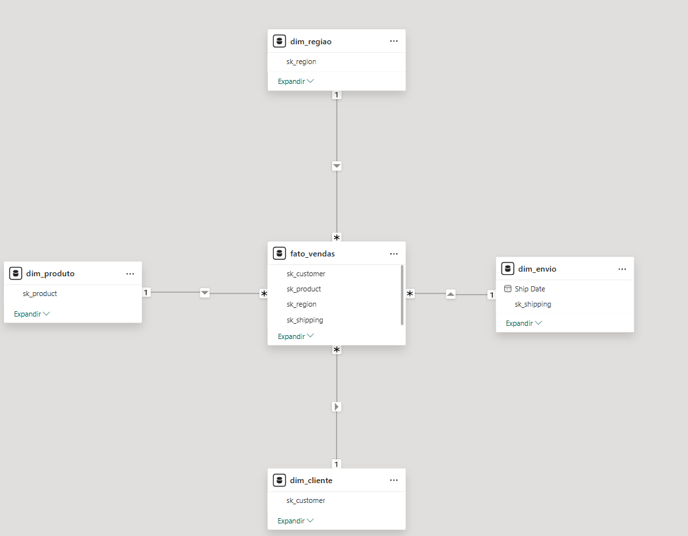

# 🚀 Star Schema com SuperStore - Engenharia de Dados

## 📌 Sobre o Projeto

 ** LINK DO DATASET ORIGINAL: https://www.kaggle.com/datasets/vivek468/superstore-dataset-final **

Este projeto tem como objetivo transformar dados brutos de vendas do SuperStore em um **modelo dimensional (star schema)**, aplicando conceitos fundamentais de engenharia de dados:

- **Limpeza e tratamento** de dados (nulos, duplicatas, tipos)
- **Criação de dimensões** com surrogate keys (`sk_`)
- **Tabela fato** com métricas e chaves estrangeiras
- **Validação de integridade** referencial (asserts)
- **Exportação** para CSV pronto para análise em Power BI

---

## 🏗️ Modelo Star Schema (Power BI)

*Relacionamentos criados no Power BI entre a tabela fato e as dimensões.*

---

## 📊 Tabelas Geradas

| Tabela | Registros | Descrição |
|--------|-----------|-----------|
| `dim_cliente.csv` | ~800 | Clientes únicos com surrogate key |
| `dim_produto.csv` | ~1.800 | Produtos únicos com surrogate key |
| `dim_regiao.csv` | ~600 | Localizações únicas com surrogate key |
| `dim_envio.csv` | ~200 | Combinações de data/modo de envio |
| `fato_vendas.csv` | ~9.000 | Transações com chaves estrangeiras e métricas |

---

## 🛠️ Tecnologias Utilizadas

- **Python 3.9+**
- **Pandas** (manipulação e transformação de dados)
- **PyODBC** (conexão com SQL Server)
- **Git** (versionamento)

---

## 🚀 Como Executar (Opcional)

1. Clone o repositório
2. Instale as dependências: `pip install pandas pyodbc`
3. Configure a conexão com o SQL Server no script
4. Execute: `python star_schema.py`

> **Nota:** O script foi desenvolvido para ambiente local com SQL Server. Os CSVs já estão disponíveis na pasta para análise.

---

## 📈 Principais Aprendizados

- **Modelagem dimensional:** Separação entre fatos (métricas) e dimensões (descrições)
- **Surrogate keys:** Criação de chaves artificiais para garantir integridade
- **ETL com Pandas:** Limpeza, transformação e merge de dados
- **Validação de dados:** Uso de `assert` para garantir integridade referencial
- **Boas práticas:** Código comentado, organizado e documentado

---

## 👨‍💻 Autor

**Guilherme Coradini**

